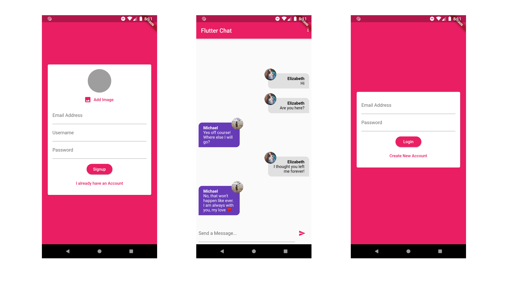

# Chat-App
Welcome Guys! This repo consists of my code for Chat App made using Flutter, which I made as a part of my course, Flutter & Dart: The Complete Guide. I have attached some screenshots of the Application as a Reference. Make sure to leave me some Feedback.  

# Features
- Use of Basic Flutter Widgets
- Use of widgets like Row, Column, ListView etc
- Theming the App
- Included forms for better User Interaction
- Used Cloud Filestore for storing the Data
- Included Authentication using Firebase, and added autoLogin functionality
- Use of Stream Builder   
- Image Upload using Firebase & Image Picker
- Use of Firebase Cloud Messaging (FCM) for Push Notifications

I'll be waiting for your precious feedback.  
Happy Coding :)

